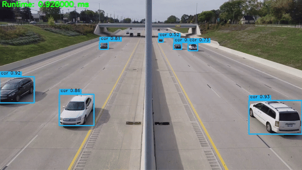

<div align="center">

YOLOv11-TensorRT
===========================

[](https://www.python.org/downloads/release/python-31012/)
[](https://developer.nvidia.com/cuda-downloads)
[](https://developer.nvidia.com/tensorrt)
[](https://github.com/spacewalk01/TensorRT-YOLOv9/tree/main?tab=MIT-1-ov-file#readme)

<div align="left">
<p align="center">
  
</p>
 
This repository hosts a C++ implementation of the state-of-the-art YOLOv11 object detection model from ultralytics, leveraging the TensorRT API for efficient, real-time inference.


## Installation

### 1. Clone the Repository

```bash
git clone https://github.com/spacewalk01/yolov11-tensorrt.git
cd yolov11-tensorrt
```

### 2. Install Dependencies

- **For Python**:
  Install required Python dependencies using pip:
  
  ```bash
  pip install --upgrade ultralytics
  ```

- **For C++**:
  Ensure that OpenCV and TensorRT are installed. Set the correct paths for these libraries in the `CMakeLists.txt` file.

### 3. Build the C++ Code

```bash
mkdir build && cd build
cmake ..
cmake --build . --config Release
```

## Usage

### Exporting the Model

1. Modify the `export.py` script if needed to set the desired model name.
2. Run the Python script to export the YOLOv11 model to ONNX format:

   ```bash
   python export.py
   ```

### Running Inference

#### 1. Create a TensorRT Engine

Convert the ONNX model to a TensorRT engine:

```bash
./yolov11-tensorrt.exe yolo11s.onnx ""
```

#### 2. Run Inference on an Image

Perform object detection on an image:

```bash
./yolov11-tensorrt.exe yolo11s.engine "zidane.jpg"
```

#### 3. Run Inference on a Video

Perform object detection on a video:

```bash
./yolov11-tensorrt.exe yolo11s.engine "road.mp4"
```

### Single-stream and Dual-stream Modes

Dual-stream mode is used by default. Select the mode with `YOLO_NUM_STREAMS`:

```bash
# Single stream: pre -> infer -> post on slot 0
YOLO_NUM_STREAMS=1 ./build/yolov11-tensorrt model.engine video.mp4

# Dual stream: two execution contexts and two alternating CUDA streams
YOLO_NUM_STREAMS=2 ./build/yolov11-tensorrt model.engine video.mp4
```

Detailed non-blocking CUDA timing can be enabled independently:

```bash
YOLO_NUM_STREAMS=1 YOLO_DETAILED_TIMING=1 \
  ./build/yolov11-tensorrt model.engine video.mp4
```

When detailed timing is disabled, CUDA timing events are not recorded. Enabling
it does not add stream synchronization; event results are collected at the
postprocess synchronization points that already exist in the inference path.

## License

This project is licensed under the AGPL-3.0 License. See the [LICENSE](LICENSE) file for details.
